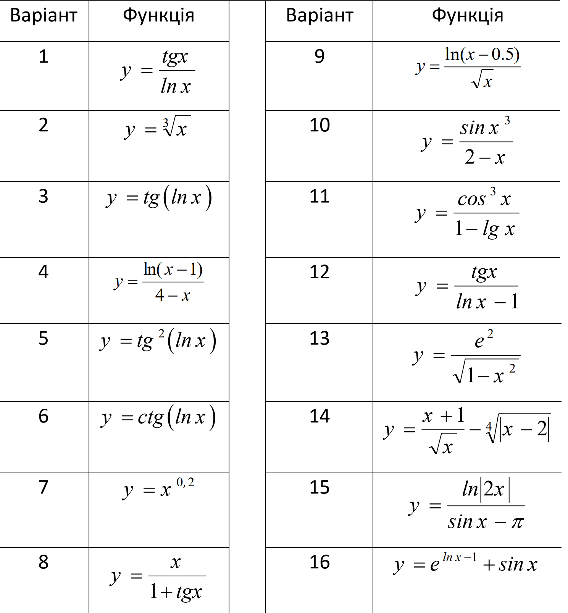

= Лабораторна робота №4 - Цикли та рекурсії

:icons: font

*Мета роботи*: отримання практичних навичок розробки циклічних програм та основ створення рекурсивних функцій.

Майже всі реальні завдання вимагають для свого рішення не тільки розгалужень,
але і багаторазового повторення однотипних дій.
Простим прикладом такого завдання є обчислення факторіала `factorial(n) = n!`.
Нагадаємо, що факторіал натурального числа `n` дорівнює добутку всіх чисел від 1 до `n`.
За прийнятою угодою, `0! = 1` та `1! = 1`, факторіал від негативного числа не визначений.

== Рекурсивна функція

Найбільш простим для побудови програмної реалізації є **індуктивне** визначення факторіала,
згідно з яким `n! = n(n-1)!`. Базою індуктивного визначення служать угоди про значення `0!` та `1!`.
Мовою Kotlin подібне визначення реалізується в такий спосіб:

[source,kotlin]
----
fun factorial(n: Int): Int = if (n < 2) 1 else n * factorial(n - 1)
----

Тут ми використовували прийом програмування під назвою __рекурсія__.
Для обчислення результату функції `factorial` відбувається виклик цієї ж функції, але з меншим значенням аргументу.
Рано чи пізно умова `if (n<2)` виявиться виконаною, і значення функції буде обчислено.

== Цикл for, змінні, інтервали та прогресії

Можлива також реалізація ітеративного визначення, а саме `n! = 1 * 2 * ... * (n-1) * n`.
Для цього необхідно використовувати __цикли__;
найбільш поширеним в Kotlin є цикл **for**, який підходить і для цього завдання.
Реалізація буде виглядати так:

[source,kotlin]
----
fun factorial(n: Int): Int {
    // Змінна, що мутує (var)
    var result = 1
    for (i in 1..n) {
        result = result * i
    }
    return result
}
----

Конструкція `for (i in 1..n) { ... }` читається як "Для всіх i в __інтервалі__ від 1 до n (виконати) ...".
У даній конструкції оголошується __параметр__ циклу **for**, якому дається ім'я `i`.
Усередині фігурних дужок знаходиться __тіло__ циклу **for**.
Тіло циклу в даному випадку буде виконано `n` разів, тобто відбудеться `n` __ітерацій__.
На кожній __ітераціі__ параметр `i` матиме **різні** значення - від `1` до `n`.

Рядком вище оголошена так звана __мутуюча__ змінна `result`.
Для її оголошення ми використовували ключове слово **var** (variable) -
на відміну від **val** (value) для звичайних змінних.
Мутуюча змінна отримує значення 1 при її оголошенні,
але в процесі виконання функції вона може ** змінювати ** своє значення.

Оператор `result = result * i` виконує так зване __присвоювання__ змінній, що мутує, іншого значення.
При цьому спочатку береться її поточне значення (наприклад, 2 на 3-й ітерації циклу),
воно множиться на значення параметра `i` (3 на 3-й ітерації циклу)
і результат (6) __присвоюється__ змінній `result`.
Якби ми оголосили змінну `result` як` val result = 1`,
то в цьому рядку функції ми отримали б помилку:

----
val cannot be reassigned
----

В останньому операторі `return result` визначається остаточний результат обчислення факторіалу.

Оператор **for** може використовуватися НЕ тільки для перебору чисел в __інтервалі__ (від меншого до більшого з кроком 1), але і для перебору чисел в заданій __прогресії__.
Інтервал, як ми вже бачили, створюється оператором виду `min..max`.
Типові приклади створення прогресії виглядають так:

* `10 downTo 1` -- прогресія від більшого числа до меншого, з кроком 1 (10, 9, 8, ..., 1);
* `1..99 step 2` -- прогресія від меншого числа до більшого, але з кроком 2 (в даному випадку, перебір всіх непарних чисел за зростанням);
* `100 downTo 2 step 2` -- прогресія від більшого числа до меншого, з кроком 2 (перебір всіх парних чисел за спаданням).

== Модифікуючі оператори

Відкривши файл `MainLab4.kt` в IDE і подивившись на визначення функції `factorial` зверху файла.
Можна побачити, що оператор `result = result * i` підкреслений сірою хвилястою лінією.
Якщо навести на нього курсор миші, можна побачити повідомлення "Replace with *= operator", тобто "Замінити оператором *=".
Після натискання Alt + Enter, з'явиться контекстне меню з символом лампочки і командою "Replace with *= operator".
Натиснувши Enter, у IDE виконається заміна, що запропонована. Новий текст функції буде таким:

[source,kotlin]
----
fun factorial(n: Int): Int {
    // Мутуюча змінна (var)
    var result = 1
    for (i in 1..n) {
        result *= i
    }
    return result
}
----

Оператор `*=` відноситься до великої групи __модифікуючих__ операторів і виконує **домноження**
поточного значення змінної `result` на значення параметра `i`.
Аналогічно йому працюють оператори `+=`, `-=`, `/=`, `%=` та деякі інші.

== Послідовна перевірка умов

Розглянемо тепер дещо складніший приклад.
Нехай нам потрібно написати функцію, яка перевіряє натуральне число на простоту.
Нагадаємо, що число називається простим (prime), якщо воно ділиться без остачі тільки на одиницю і на себе,
і складеним, якщо у нього є й інші дільники (одиниця зазвичай не рахується ні простим, ні складеним числом).

Прямолінійна перевірка передбачає ділення заданого числа `n` послідовно на числа в інтервалі від `2` до `n-1`.
Щоб перевірити, чи ділиться число `n` націло на інше число `m`,
досить порівняти залишок від ділення `n % m` з нулем.
Якщо хоча б раз ми успішно поділили без остачі - початкове число `n` не є простим.

[source,kotlin]
----
fun isPrime(n: Int): Boolean {
    if (n < 2) return false // Необхідно, оскільки 1 -- не просте число
    for (m in 2..n - 1) {
        if (n % m == 0) return false
    }
    return true
}
----

Зверніть увагу, що, знайшовши дільник, ми відразу повідомляємо про те, що результат - **false** -
при цьому переривається як виконання циклу, так і виконання функції, оскільки результат вже визначений.
Щоб довести, що число є складеним, нам досить знайти хоча б ОДИН дільник від 2 до n-1.
Однак про результат **true** ми можемо повідомити тільки після закінчення циклу, перевіривши ВСІ дільники:
щоб довести простоту числа, треба переконатися, що ЖОДНЕ число від 2 до n-1 не є дільником.
Початківці часто роблять ось таку помилку:

[source,kotlin]
----
    for (m in 2..n - 1) {
        if (n % m == 0) return false
        else return true
    }
----

що, звісно, невірно.
Такий цикл буде виконано тільки один раз, результат буде **true** для непарних і **false** для парних чисел.

В тестовій функції можна перевірити, що числа 2, 5 і 11 є простими, а числа 1, 4, 9 і 15 -- складеними.
Також, можна написати більш складну перевірку, використовуючи той факт,
що перші 1000 простих чисел лежать в інтервалі від 2 до 7919 -- див. https://en.wikipedia.org/wiki/List_of_prime_numbers[Список простих чисел]

[source,kotlin]
----
    @Test
    fun isPrime() {
        var count = 0
        for (n in 2..7919) {
            if (isPrime(n)) {
                count++
            }
        }
        assertEquals(1000, count)
    }
----

Ми в циклі перевіряємо числа від 2 до 7919 на простоту.
Кожен раз, коли число виявляється простим, ми виконуємо оператор `count++` -
скорочена форма запису `count = count + 1` або `count += 1`, так званий оператор __інкремента__
(Існує також оператор `--`, або оператор __декремента__).

Спробуємо тепер за допомогою `isPrime` дізнатися, скільки існує простих чисел, менших десяти мільйонів
(Для цього достатньо замінити в наведеному фрагменті коду 7919 на 10000000).
Якщо запустити таку функцію на виконання, воно займе досить багато часу.
Вся справа в тому, що наша функція `isPrime (n: Int)` виконує зайві перевірки.
Зокрема, досить перевірити ділимість числа `n` на всі числа в інтервалі від 2 до n / 2,
оскільки на великі числа `n` все одно ділитись не буде.
Більш того, досить обмежиться інтервалом від 2 до &radic;n -
якщо `n` і ділиться на деяке більше &radic;n число (наприклад, 50 ділиться на 10),
то воно буде ділиться і на деяке менше число (в даному випадку, 50 ділиться на 5 = 50/10).

[source,kotlin]
----
fun isPrime(n: Int): Boolean {
    if (n < 2) return false // Необхідно, оскільки 1 -- не просте число
    for (m in 2..sqrt(n.toDouble()).toInt()) {
        if (n % m == 0) return false
    }
    return true
}
----

Зверніть увагу, що перед обчисленням квадратного кореня ми були змушені скористатися
функцією `n.toDouble()` для отримання дійсного числа з цілого,
а після обчислення - функцією `.toInt()` для отримання цілого числа з дійсного.
Обидві ці вбудовані в Kotlin функції мають незвичайну для початківців форму записи, яка читається як
"n перетворити до Double", "... перетворити до Int".
Замість того, щоб записати аргумент всередині круглих дужок `toDouble(n)`,
ми записуємо його перед ім'ям функції, відокремлюючи його від імені символом точки.
Подібний аргумент функції називається її __отримувачем__ (receiver),
в майбутньому така форма запису буде використовуватися неодноразово.

== Переривання та продовження циклу

При програмуванні циклів часто зустрічаються ситуації, коли необхідно перервати виконання циклу достроково, або ж достроково перейти до початку його наступної ітерації.
Для цієї мети в мові Kotlin використовуються оператори **break** і **continue**.

Продемонструємо їх на прикладі.
Досконалим числом називається таке натуральне число, що дорівнює сумі всіх своїх дільників, крім себе самого.
Зокрема, 6 = 1 + 2 + 3 і 28 = 1 + 2 + 4 + 7 + 14 - досконалі числа.
Напишемо функцію, що визначає, чи є задане число `n` досконалим.

[source,kotlin]
----
fun isPerfect(n: Int): Boolean {
    var sum = 1
    for (m in 2..n/2) {
        if (n % m == 0) {
            sum += m
            if (sum > n) break
        }
    }
    return sum == n
}
----

Ця функція перебирає всі можливі дільники числа `n` від 2 до n / 2
(Одиницю перебирати безглуздо, оскільки на неї ділиться будь-яке число -
тому мутуюча змінна `sum` спочатку дорівнює 1, а не 0).
Кожен знайдений дільник додається до суми.
Якщо в якийсь момент набрана сума виявилася більшою `n` - цикл можна перервати за допомогою **break**,
оскільки наступні подільники можуть тільки збільшити її ще більше.
Після переривання циклу виконується наступний за ним оператор, в даному випадку **return**.

Інший варіант запису тієї ж самої функції, який використовує оператор продовження **continue**:

[source,kotlin]
----
fun isPerfect(n: Int): Boolean {
    var sum = 1
    for (m in 2..n/2) {
        if (n % m > 0) continue
        sum += m
        if (sum > n) break
    }
    return sum == n
}
----

Тут замість того, щоб перевірити, що `n` ділиться на` m`, ми перевіряємо зворотну умову - що `n` НЕ ДІЛИТЬСЯ на` m`.
Якщо воно вірно, виконується оператор **continue**, при цьому залишок даної ітерації циклу пропускається,
відбувається збільшення значення `m` на 1 і перехід до наступної ітерації.
Обидві реалізації `isPerfect` рівнозначні, застосування тієї чи іншої з них - справа смаку.

== Цикли while і do..while

Іноді трапляється так, що необхідний цикл не зводиться до перебору якогось заздалегідь відомого набору елементів.
В цьому випадку в мові Kotlin замість циклу **for** застосовуються цикли **while** або **do..while**.
Як приклад розглянемо таку задачу:
знайти число входжень цифри `m` (від 0 до 9) в десятковий запис невід'ємного числа `n`.
Наприклад, в число n = 5373393 цифра m = 3 входить чотири рази.

Для вирішення цього завдання нам необхідно в циклі перебрати всі цифри числа `n`.
Для отримання молодшої цифри числа досить взяти залишок від його поділу на 10,
для відкидання молодшої цифри слід розділити його на 10.
За допомогою циклу **while** це записується в такий спосіб.

[source,kotlin]
----
fun digitCountInNumber(n: Int, m: Int): Int {
    var count = 0
    var number = n
    while (number > 0) {
        if (m == number % 10) {
            count++
        }
        number /= 10
    }
    return count
}
----

На відміну від циклу **for**, цикл **while** потенційно може виконатися будь-яку кількість разів.
Перед кожною новою ітерацією циклу (в тому числі перед першою), цикл **while** перевіряє записану в дужках умову.
Якщо вона вірна, ітерація виконується, якщо ні, цикл завершується.
Для даного прикладу при n = 5373393 виконається сім ітерацій циклу - по числу цифр у числі.

Якщо уважно порозмірковувати, можна побачити, що така реалізація "зламається" для наведеного далі тесту
[source,kotlin]
----
    @Test
    fun digitCountInNumber() {
        assertEquals(1, digitCountInNumber(0, 0))
    }
----

В цьому прикладі ми очікуємо, що цифра 0 входить в число 0 один раз. Однак, написана вище функція дає відповідь 0.
Виправити функцію можна таким чином:

[source,kotlin]
----
fun digitCountInNumber(n: Int, m: Int): Int {
    var count = 0
    var number = n
    do {
        if (m == number % 10) {
            count++
        }
        number /= 10
    } while (number > 0)
    return count
}
----

В даному прикладі цикл **while** було замінено циклом **do..while**.
Відмінність його полягає в тому, що умова після ключового слова **while** перевіряється не ПЕРЕД кожною ітерацією,
а ПІСЛЯ кожної ітерації, через це тіло циклу **do..while** завжди виконується хоча б один раз.
Тому дані цикли називаються __циклом з передумовою__ (while) або __циклом з післяумовою__ (do..while).

Конкретно для випадку з n = 0 цикл **while** не буде виконано жодного разу, і результат залишиться таким, що дорівнює 0.
Цикл **do..while** буде виконаний один раз, в числі буде знайдена цифра 0 і результат буде дорівнювати 1, тобто в даному конкретному випадку цикл **do..while** краще підходить для вирішення задачі.
У загальному випадку, будь-яке завдання може бути вирішене із застосуванням будь-якого з цих двох циклів, питання лише в тому, яке рішення буде виглядати краще. Цикл **while** на практиці зустрічається значно частіше.

Зауважимо, що у даного завдання можливо і рекурсивне рішення. Як його можна придумати?
Для цього спочатку слід вирішити задачу в тривіальному випадку - для n < 10.
При цьому результат буде дорівнювати 1, якщо m = n, і 0 в іншому випадку.
Після цього слід придумати перехід від числа з великою кількістю цифр до числа або чисел, в яких цифр менше.
Наприклад, число n можна розбити на два інших: n%10, що містить тільки останню цифру,
та n/10, що містить всі інші цифри:

[source,kotlin]
----
fun digitCountInNumber(n: Int, m: Int): Int =
        when {
            n == m -> 1
            n < 10 -> 0
            else -> digitCountInNumber(n / 10, m) + digitCountInNumber(n % 10, m)
        }
----

Зверніть увагу, що рекурсивне рішення часто коротше і витонченіше ітеративного.

== Завдання

=== Завдання 4.1
Представити математичний запис фрагмента програми та обчислити значення змінної `x` після його виконання, де `n` – це номер варіанта

[cols="1,4,1,4"]
|===
^|Варіант ^|Фрагмент ^|Варіант ^|Фрагмент
^|1-3
| `*var* x = 1 +
  *for* (j *in* 7 downTo n) x *= j +
  x *= 2`
^|4-6
| `*var* x = 0 +
  *var* j = 1 +
  *do* { +
&nbsp;&nbsp;&nbsp;&nbsp;x += j +
&nbsp;&nbsp;&nbsp;&nbsp;j += 2 +
  } *while* (j &lt;=n)`

^|7-9
| `*var* x = 0.0 +
  *var* k - 3 * n +
  *while* (k > 0) { +
&nbsp;&nbsp;&nbsp;&nbsp;x = sqrt(k+x) +
&nbsp;&nbsp;&nbsp;&nbsp;k -= 3 +
  }`

^|10-12
| `*var* x = n +
  *for* (k *in* 0..5) { +
&nbsp;&nbsp;&nbsp;&nbsp;**if** (k < 2) *continue* +
&nbsp;&nbsp;&nbsp;&nbsp;x++ +
  }`

^|13-15
| `*var* x = 0 +
  *for* (j *in* 0 until n) x += 2 +
  x *= 2`

^|16-18
|`*var* x = 1 +
 *while* (x &lt;= n) x++
 x *= 2`
|===

=== Завдання 4.2
Скласти програму табулювання функції _f(x)_  на відрізку [_a_; _b_] з кроком _h_
Значення _a_, _b_, _h_ вводити з клавіатури.

[cols="1,3,1,3,1,3"]
|===
^|Варіант ^|Функція ^|Варіант ^|Функція ^|Варіант ^|Функція

^|1
| \[ y = \frac {tg x}{ln x} \]
^|2
| \[y = \sqrt[3]{x}\]
^|3
| \[y = tg (ln x)\]
^|4
| \[y= \frac{ln(x-1)}{4-x}\]
^|5
| \[y=tg^2 (ln x)\]
^|6
| \[y=ctg(ln x)\]
^|7
| \[y=x^{0.2}\]
^|8
| \[y=\frac{x}{1+tgx}\]
^|9
| \[y=\frac{ln(x-0.5)}{\sqrt{x}}\]
^|10
| \[y=\frac{sin x^3}{2-x}\]
^|11
| \[y=\frac{cos^3 x}{1 - lgx}\]
^|12
| \[y=\frac{tg x}{lnx-1}\]
^|13
| \[y=\frac{e^2}{\sqrt{1 - x^2}}\]
^|14
| \[y=\frac{x+1}{\sqrt{x}} - \sqrt[4]{\|x - 2\|} \]
^|15
| \[y=\frac{ln \|2x\|}{sinx - \pi}\]
^|16
| \[y=e^{ln x -1} + sin x\]
^|17
| \[y= \frac{4-x}{ln(x-1)}\]
^|18
| \[y=\frac{e^{x ^ 2}}{\sqrt{1 - x^2}}\]
|===

=== Завдання 4.3
Для заданих _x_, _n_, _e_, що вводяться з клавіатури:

["loweralpha"]
. обчислити _n_ доданків згідно варіанту
. обчислити суму тих доданків, які за абсолютним значенням більше _e_.
(Завдання виконати для двох різних e, які відрізняються на порядок, для кожного випадку обчислити кількість доданків)
. Порівняти результати з "точним" значенням відповідної функції (сума визначає наближене значення) для _x Є (-R,R)_

=== Варіант 1
\[\frac{sinx}{x} = 1 - \frac{x^2}{3!} + \frac{x^4}{5!} - \frac{x^6}{7!} + ... (R = \infty) \]

=== Варіант 2
\[e^{-x ^ 2} = 1 - \frac{x^2}{1!} + \frac{x^4}{2!} - ... + (-1)^n \frac{x^{2n}}{n!} (R = \infty) \]

=== Варіант 3
\[ln(x+\sqrt{x^2+1}) = x - \frac{1}{2}\cdot\frac{x^3}{3} + \frac{1}{2}\cdot\frac{3}{4}\cdot\frac{x^5}{5}-\frac{1}{2}\cdot\frac{3}{4}\cdot\frac{5}{6}\cdot\frac{x ^7}{7} + ... (R = 1) \]

=== Варіант 4
\[arctg x = x - \frac{x^3}{3} + \frac{x^5}{5} - \frac{x^7}{7} + \frac{x^9}{9} - ... (R =1) \]

=== Варіант 5
\[arcsin x = x + \frac{1}{2}\cdot\frac{x^3}{3} + \frac{1}{2}\cdot \frac{3}{4}\cdot\frac{x^5}{5} + \frac{1}{2}\cdot \frac{3}{4}\cdot\frac{5}{6}\cdot\frac{x^7}{7} + ... (R=1)  \]

=== Варіант 6
\[\frac{1}{\sqrt{1-x^2}} = 1 + \frac{1}{2}\cdot x^2 + \frac{1}{2}\cdot\frac{3}{4}\cdot x^4 + \frac{1}{2}\cdot\frac{3}{4}\cdot\frac{5}{6}\cdot x^6 + ... (R=1) \]

=== Варіант 7
\[\frac{1}{\sqrt{1+x}} = 1 - \frac{1}{2}\cdot x + \frac{1}{2}\cdot\frac{3}{4}\cdot x^2 - \frac{1}{2}\cdot\frac{3}{4}\cdot\frac{5}{6}\cdot x^3 + ... (R=1) \]

=== Варіант 8
\[\sqrt{1+x} = 1 + \frac{1}{2}\cdot x - \frac{1}{2 \cdot 4}\cdot x^2 + \frac{1 \cdot 3}{2 \cdot 4 \cdot 6}\cdot x^3 - ... (R=1) \]

=== Варіант 9
\[\frac{1}{(1+x)^3} = 1 - \frac{2 \cdot 3}{2} \cdot x + \frac{3 \cdot 4}{2}\cdot x^2 - \frac{4 \cdot 5}{2}\cdot x^3 + ... (R=1) \]

=== Варіант 10
\[\frac{1}{(1+x)^2} = 1 - 2x + 3x^2 - 4x^3 + 5x^4 - ... (R=1)\]

=== Варіант 11
\[\frac{1}{1+x} = 1 - x + x^2 - x^3 + x^4 - ... (R=1) \]

=== Варіант 12
\[ln\frac{1+x}{1-x} = 2 \cdot (x + \frac{x^3}{3} + \frac{x^5}{5} + \frac{x^7}{7} + \frac{x^9}{9} + ...)  (R=1) \]

=== Варіант 13
\[ln(1-x) = -\frac{x}{1} -\frac{x^2}{2} - \frac{x^3}{3} - \frac{x^4}{4} - ... (R=1) \]

=== Варіант 14
\[ln(1+x) = \frac{x}{1} -\frac{x^2}{2} + \frac{x^3}{3} - \frac{x^4}{4} - ... (R=1) \]

=== Варіант 15
\[ch(x) = 1 + \frac{x^2}{2!} + \frac{x^4}{4!} + \frac{x^6}{6!} + ... (R=\infty) \]

=== Варіант 16
\[sh(x) = 1 + \frac{x^3}{3!} + \frac{x^5}{5!} + \frac{x^7}{7!} + ... (R=\infty) \]

=== Варіант 17
\[cos(x) = 1 - \frac{x^2}{2!} + \frac{x^4}{4!} - \frac{x^6}{6!} + ... (R=\infty) \]

=== Варіант 18
\[sin(x) = x - \frac{x^3}{3!} + \frac{x^5}{5!} - \frac{x^7}{7!} + ... (R=\infty) \]

=== Варіант 19
\[e^x = 1 + \frac{x}{1!} + \frac{x^2}{2!} + \frac{x^3}{3!} + ... (R=\infty) \]

=== Варіант 20
\[e^{-x} = 1 - \frac{x}{1!} + \frac{x^2}{2!} - \frac{x^3}{3!} + ... (R=\infty) \]
